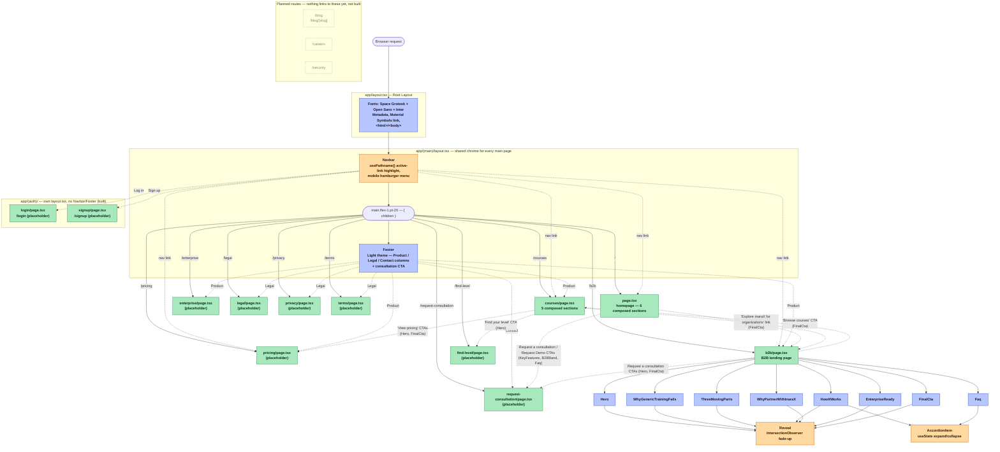

# InaraX

InaraX is a B2B platform: an organization subscribes, and InaraX builds an
AI-skills training course personalized to every role and seniority level on
their team. Employees learn inside the app; org admins track progress,
completion, and quiz scores from a dashboard.

This repo is the main/product web app. Three pages are fully built: `/`
(the homepage), `/b2b` (a marketing landing page), and `/courses`. Every
other route — `/pricing`, `/enterprise`, `/legal`, `/privacy`, `/terms`,
`/request-consultation`, `/find-level`, `/login`, `/signup` — is a minimal
one-heading placeholder, just enough that every Navbar/Footer link and
in-page CTA resolves instead of 404ing. This is a fresh Next.js (App Router) project originally built from
a static design mockup at `frontend-stitch/code.html`, translated into
typed React components and a Tailwind v4 theme, then restyled to match two
further mockups — `frontend-stitch/home/code.html` (the "Corporate
Modernism" palette, Space Grotesk headings, the current light footer) and
`frontend-stitch/courses/code.html` (the `/courses` page source, plus a
few additional theme refinements — see `changes/*.md` for the full
history of what changed and why).

## Table of contents

- [InaraX](#inarax)
  - [Table of contents](#table-of-contents)
  - [Tech stack](#tech-stack)
  - [Getting started](#getting-started)
  - [Directory tree](#directory-tree)
  - [Architecture diagram](#architecture-diagram)
  - [How the b2b page fits together](#how-the-b2b-page-fits-together)
    - [Server vs. Client components](#server-vs-client-components)
    - [Sticky footer](#sticky-footer)
  - [Reusable primitives (`components/ui/`)](#reusable-primitives-componentsui)
  - [Theming (`app/globals.css`)](#theming-appglobalscss)
  - [Route plan](#route-plan)
  - [Known gaps / follow-ups](#known-gaps--follow-ups)
  - [Mobile navigation](#mobile-navigation)

## Tech stack

| Layer       | Choice                                                          |
| ----------- | ---------------------------------------------------------------- |
| Framework   | [Next.js 16](https://nextjs.org) (App Router, Turbopack)         |
| Language    | TypeScript (strict mode)                                         |
| Styling     | Tailwind CSS v4 (CSS-first config, no `tailwind.config.ts`)      |
| Fonts       | `next/font/google` — Space Grotesk (display/headline), Open Sans (body/label-md), Inter (legacy `headline-sm`/`label-caps` tokens only) |
| Icons       | Google Material Symbols Outlined (`<link>` in `app/layout.tsx`)  |
| Package mgr | npm                                                               |

No test runner, database, auth, or API layer exists yet — this is a static
main page.

## Getting started

```bash
npm install
npm run dev      # http://localhost:3000 (or next free port)
npm run build    # production build
npm run start    # serve the production build
npm run lint     # eslint (next/core-web-vitals + next/typescript)
npx tsc --noEmit # typecheck
```

## Directory tree

```
inarax-new/
├── app/
│   ├── layout.tsx                # Root layout: fonts, metadata, <html>/<body>
│   ├── globals.css               # Tailwind import, @theme design tokens, custom CSS
│   ├── favicon.ico
│   ├── (main)/               # Route group — shared Navbar + Footer layout
│   │   ├── layout.tsx              # Renders <Navbar/> + <main> + <Footer/> around every page below
│   │   ├── page.tsx                 # "/" — composes the sections below
│   │   ├── _sections/                # Private folder — homepage-only sections
│   │   │   ├── Hero.tsx, KeyFeatures.tsx, PersonalizedPath.tsx (+ PathSteps.tsx,
│   │   │   │   TwoBrainsArchitecture.tsx, B2BBand.tsx), WhyChooseInaraX.tsx,
│   │   │   │   Faq.tsx, FinalCta.tsx
│   │   ├── courses/                 # "/courses" — built page
│   │   │   ├── page.tsx                # Composes the sections below
│   │   │   └── _sections/              # Private folder — courses-page-only sections
│   │   │       ├── Hero.tsx, ProgramCards.tsx, HowInaraxAdapts.tsx (+
│   │   │       │   AdaptiveShowcase.tsx, EcosystemFeatures.tsx), CommunityBlurb.tsx,
│   │   │       │   FinalCta.tsx
│   │   ├── pricing/page.tsx         # "/pricing" — placeholder page
│   │   ├── b2b/                     # "/b2b" — the built marketing landing page
│   │   │   ├── page.tsx                # Composes the eight sections below in mockup order
│   │   │   └── _sections/              # Private folder — b2b-page-only sections
│   │   │       ├── Hero.tsx, WhyGenericTrainingFails.tsx, ThreeMovingParts.tsx,
│   │   │       │   HowItWorks.tsx, WhyPartnerWithInaraX.tsx, EnterpriseReady.tsx,
│   │   │       │   Faq.tsx, FinalCta.tsx
│   │   ├── enterprise/, legal/, privacy/, terms/, request-consultation/, find-level/
│   │   │   └── page.tsx                # One-heading placeholder pages
│   └── (auth)/                # Route group — own layout, no Navbar/Footer
│       ├── layout.tsx              # Centered, chrome-free shell
│       ├── login/page.tsx          # "/login" — placeholder page
│       └── signup/page.tsx         # "/signup" — placeholder page
├── components/
│   ├── layout/
│   │   ├── Navbar.tsx            # Site-wide fixed nav (used on every (main) page)
│   │   └── Footer.tsx            # Site-wide footer
│   └── ui/
│       ├── Reveal.tsx            # Scroll-triggered fade-up wrapper (Client Component)
│       └── AccordionItem.tsx     # Generic expand/collapse primitive (Client Component)
├── public/                       # Static assets served at /  (currently just create-next-app boilerplate SVGs)
├── frontend-stitch/
│   ├── code.html                 # Original static mockup this app was first built from
│   ├── home/
│   │   ├── code.html                # Second mockup — the homepage / "Corporate Modernism" theme source
│   │   └── DESIGN.md                # Design-system notes (palette, type, shape) for the home/ mockup
│   └── courses/
│       └── code.html                # Third mockup — the /courses page source
├── changes/                      # Build logs: what was built, CSS conflicts found, and how they were resolved
│   ├── home-page-build-log.md
│   ├── courses-page-build-log.md
│   └── color-consolidation-build-log.md
├── docs/                         # Next.js's own documentation, mirrored locally (see AGENTS.md — read before Next.js work)
├── next.config.ts / tsconfig.json / eslint.config.mjs / postcss.config.mjs
├── package.json
├── AGENTS.md / CLAUDE.md         # Engineering conventions for this repo (CLAUDE.md just points to AGENTS.md)
└── README.md                     # This file
```

## Architecture diagram

Visual map of every route, layout, and component and how they connect —
solid arrows are render/import relationships, dotted arrows are link/route
references (Navbar/Footer `href`s, not build-time imports).

- 🟩 built route (`page.tsx`)
- 🟦 Server Component
- 🟧 Client Component (`"use client"`)
- ⬜ (dashed) planned route — not built yet, link will 404



## How the b2b page fits together

`app/(main)/layout.tsx` renders `<Navbar />`, a `<main className="pt-20">`
wrapping `{children}`, and `<Footer />` around every page in the `(main)`
route group — so every main page gets the same chrome for free, without
each `page.tsx` re-importing `Navbar`/`Footer` itself.

`/` was originally the homepage that composed all eight marketing sections;
it has since been repurposed as a placeholder, and that section composition
moved to `app/(main)/b2b/page.tsx` (`/b2b`) instead. `b2b/page.tsx` is a thin
composition file — it just renders all eight sections in mockup order. Each
section is its own file under `app/(main)/b2b/_sections/`, one per block in
the original mockup:

1. **Hero** — badge, headline, CTA, hero image in a rounded glass frame.
2. **WhyGenericTrainingFails** — problem statement + callout card.
3. **ThreeMovingParts** — org dashboard / InaraX / roles, 3-card grid.
4. **HowItWorks** — Subscribe → Course → Monitor, as an accordion.
5. **WhyPartnerWithInaraX** — 4-card audience grid (Procurement, L&D, Leadership, End Learner).
6. **EnterpriseReady** — 5-card grid (SSO, admin controls, expert review, data security, Atomcamp backing).
7. **Faq** — 6-question accordion.
8. **FinalCta** — dark closing CTA band.

`_sections/` uses the `_` prefix (a Next.js **private folder**) so these
files are colocated with the route that uses them but are never themselves
routable — they're implementation detail of `/b2b`, not pages.

`Navbar` and `Footer` live at the top level under `components/layout/`,
not inside `_sections/` or the `(main)` folder, since `app/(main)/layout.tsx`
imports them once and every page in the group shares that one instance.

### Server vs. Client components

Per this repo's conventions (see `AGENTS.md`), everything is a Server
Component unless it actually needs interactivity or browser APIs:

- `Footer` and all eight section files are **Server Components** — no `"use client"`, no state.
- `Navbar` is a **Client Component** — it calls `usePathname()` (from `next/navigation`) to highlight whichever nav link matches the current route, which only works client-side.
- `components/ui/Reveal.tsx` and `components/ui/AccordionItem.tsx` are also **Client Components** — they need `useState`/`useEffect`/`IntersectionObserver`, which only run in the browser.

Sections import `Reveal`/`AccordionItem` where they need that behavior;
everything else in a section is plain static JSX.

### Sticky footer

`app/(main)/layout.tsx` wraps `Navbar`/`main`/`Footer` in a
`flex min-h-screen flex-col` container with `main` set to `flex-1`. Without
this, short pages (`/`, `/courses`, `/pricing` — all placeholders) render
shorter than the viewport and the footer ends up floating mid-page with
empty space below it — the classic "short content, floating footer" layout
bug. `flex-1` on `main` makes it grow to fill any leftover space, pinning
the footer to the bottom on short pages while still behaving normally
(footer directly follows content, page scrolls) on tall ones like `/b2b`.

## Reusable primitives (`components/ui/`)

The original mockup (`frontend-stitch/code.html`) drove its interactivity
with two small vanilla-JS pieces: a `toggleAccordion()` function using
CSS class toggling + `max-height` transitions, and an `IntersectionObserver`
that added a `.visible` class to elements as they scrolled into view. Both
were reimplemented as React components instead of global CSS classes + DOM
scripting:

- **`Reveal`** — wraps any content; observes itself with an
  `IntersectionObserver` (threshold `0.1`, `rootMargin: "0px 0px -50px 0px"`,
  same as the original script) and flips from
  `opacity-0 translate-y-5` to `opacity-100 translate-y-0` once it enters
  the viewport, then stops observing. Takes an optional `delayMs` prop
  (applied as inline `transitionDelay`) to stagger multiple cards in a grid,
  matching the mockup's `delay-100`/`delay-200`/etc. classes.
- **`AccordionItem`** — a generic expand/collapse primitive used by both
  the "How it works" and FAQ sections, which have different visual
  styling but identical behavior. Takes `trigger` (header content),
  `children` (panel content), and className props for the card/button/
  content/chevron so each call site can match its own mockup styling
  exactly. Internally just a `useState<boolean>` toggling between
  `max-h-0` and `max-h-[500px]` with `overflow-hidden transition-[max-height]`
  — no shared/exclusive state between instances, so (like the mockup)
  multiple items can be open at once.

> **A React key-warning gotcha inside `AccordionItem`:** the `trigger` prop
> is wrapped in a bare Fragment — `<>{trigger}</>` — instead of being
> rendered as `{trigger}` directly next to the chevron `<span>`. React only
> exempts elements from key-checking when they're created as static JSX
> siblings *at their own creation site*; `trigger` is created in the caller
> (e.g. `HowItWorks`) and merely referenced here, so rendering it as one of
> two adjacent expression children triggered a spurious "Each child in a
> list should have a unique key prop" warning pointing at `AccordionItem`.
> Wrapping it in a Fragment makes it the sole child of that JSX position
> again, which sidesteps the check entirely — no DOM node added, no
> behavior change.

## Theming (`app/globals.css`)

This project uses **Tailwind CSS v4's CSS-first config** — there is no
`tailwind.config.ts`. All custom design tokens live in an `@theme` block in
`app/globals.css`. The theme was originally ported from
`frontend-stitch/code.html`'s inline `tailwind.config` script tag, then
updated mid-project to match a second mockup, `frontend-stitch/home/code.html`
(the "Corporate Modernism" design system documented in
`frontend-stitch/home/DESIGN.md`):

- **Colors** (`--color-*`) — a ~52-token Material Design 3–style palette (`primary`, `on-surface-variant`, `surface-container-high`, etc.) → generates `bg-*`, `text-*`, `border-*` utilities. A neutral-grey palette (`surface: #f8faf9`, `on-surface: #191c1c`) with a gold `tertiary` (`#cea700`) and a green `success` family (`success: #2e7d32`, `success-container: #ecf7ed`, mirroring the `error`/`error-container` pattern, used by b2b's "why personalization matters" callout card). The `/`, `/b2b`, and `/courses` routes were each translated from a different static mockup, and each mockup's own `tailwind-config` disagreed slightly on several of these token values (`primary`, `on-surface`, `on-surface-variant`, `outline-variant`) — see `changes/color-consolidation-build-log.md` for the full audit; the home mockup (`frontend-stitch/home/code.html`) was designated the standard, so its values are what's in `globals.css` today. The block itself is organized by role family (Primary, Secondary, Tertiary, Error, Success, Surface & background, Outline, Inverse, then brand-specific one-offs) rather than alphabetically, with a heading comment per group — that grouping is the intended reading order for anyone adding a new color.
- **Border radius** (`--radius`, `--radius-lg`, `--radius-xl`, `--radius-full`) — `DEFAULT` (the bare `rounded` class) is `0.5rem`; `full` is `9999px` (a true pill/circle), matching the newer mockups. The *original* mockup intentionally set `full` to a small value (`0.75rem`, a soft rounded-square, not a circle) — anywhere that older soft-rounded look still needs to be preserved (e.g. the Hero image frame and its "For organizations" badge) uses `rounded-xl` explicitly instead of `rounded-full`, since `--radius-xl` (`0.75rem`) still holds that original value.
- **Spacing** (`--spacing-container-max`, `--spacing-margin-desktop`, `--spacing-size-xs/sm/md/lg/xl`, etc.) — named tokens used as `max-w-container-max`, `px-margin-desktop`, `gap-gutter`, `gap-size-md`, `py-size-lg`, etc. See the gotcha below on the `size-` prefix.
- **Font families** (`--font-display-lg`, `--font-headline-md`, `--font-body-md`, etc.) — each points at a CSS variable exposed by `next/font/google` in `app/layout.tsx`. `display-lg`/`display-lg-mobile`/`headline-md`/`headline-lg` use `--font-space-grotesk`; `body-md`/`body-lg`/`label-md` use `--font-open-sans`; the older `headline-sm`/`label-caps` tokens (still used in a few places, e.g. `Navbar`'s CTA buttons) were deliberately left on `--font-inter` rather than migrated, so Inter stays loaded alongside Space Grotesk and Open Sans.
- **Font sizes** (`--text-*` + paired `--text-*--line-height` / `--letter-spacing` / `--font-weight`) — Tailwind v4's way of expressing a design-system type scale (size + line-height + tracking + weight bundled under one utility name).

> **Gotcha: naming a `--spacing-*` token `xs`/`sm`/`md`/`lg`/`xl` hijacks
> `max-w-*`/`w-*`/`h-*` etc.** Tailwind v4 resolves sizing utilities
> (`w-*`, `h-*`, `max-w-*`, `max-h-*`, `min-w-*`, `min-h-*`) from the
> `--spacing-*` scale *before* falling back to the dedicated `--container-*`
> scale it normally uses for `max-w-xs` through `max-w-7xl`. When the
> `home/` mockup's spacing scale (`xs: 4px`, `sm: 12px`, `md: 24px`,
> `lg: 48px`, `xl: 80px`) was first added directly as `--spacing-xs`
> through `--spacing-xl`, it silently redefined `max-w-xl` from its default
> `36rem` down to `80px` — collapsing the Hero paragraph (`max-w-xl`) to a
> sliver of its intended width, with no error, since both are valid
> theme values. The fix: the new scale is namespaced as
> `--spacing-size-xs` … `--spacing-size-xl` (`gap-size-md`, `py-size-lg`,
> etc.) instead of reusing Tailwind's reserved `xs/sm/md/lg/xl` names, so
> `max-w-xl` (and any future `w-*`/`h-*` usage) stays untouched.

Two small pieces of plain CSS live in `app/globals.css` because Tailwind has
no utility for them, both wrapped in **`@layer components`**:

- `.material-symbols-outlined` — sets the icon font's `font-variation-settings` axes (`FILL`, `wght`, `GRAD`, `opsz`).
- `.glass-card` — the frosted-glass card look (`backdrop-filter: blur(20px)`, translucent background, custom box-shadow, hover lift) used across Hero, ThreeMovingParts, HowItWorks, WhyPartnerWithInaraX, and EnterpriseReady.
- `.grid-blueprint`, `.soft-glow-shadow`, `.primary-cta-glow` — utilities ported from the `home/` mockup's `<style>` block (faint 12-column blueprint lines, and the "powered on" glow used for primary CTAs). Not yet applied to any component — available for future use.

> **Why `@layer components` matters:** Tailwind v4 emits all of its own
> utilities inside `@layer utilities`. CSS cascade layers mean **un-layered
> rules always beat layered rules**, regardless of source order. Early on,
> `.glass-card` was plain (un-layered) CSS, which meant its own `background`
> silently overrode utility classes like `bg-primary` on any element
> combining both (this broke the "Central Intelligence" card in
> `ThreeMovingParts.tsx` — it rendered with no background/text at all).
> Wrapping custom classes in `@layer components` fixes this permanently:
> utility classes can always override them, same as everywhere else in
> Tailwind.

The old `prefers-color-scheme: dark` background/foreground block and
Geist fonts from the create-next-app boilerplate were removed — neither
mockup has a dark mode (`darkMode: "class"` is configured but never used)
and neither uses Geist.

The `home/` mockup's own vanilla-JS scroll-reveal (`.reveal-on-scroll`/
`.active` classes + a global `IntersectionObserver`) was **not** ported —
`components/ui/Reveal.tsx` already implements the same fade-up-on-scroll
behavior as a React component, and adding a second, CSS-class-driven way to
do it would conflict with that existing convention.

## Route plan

`/`, `/courses`, `/pricing`, `/b2b`, `/enterprise`, `/legal`, `/privacy`,
`/terms`, `/request-consultation`, `/find-level`, `/login`, and `/signup`
are all built — `/`, `/b2b`, and `/courses` as fully composed pages, every
other page (including the two auth pages) as a minimal one-heading
placeholder, just enough that every Navbar/Footer link and in-page CTA
resolves to a real page instead of a 404. `/solutions` existed earlier in
the project but has since been removed (no nav link, no route, no planned
route). `/blog`, `/careers`, and `/security` remain planned but not
built — nothing currently links to them:

```
app/(main)/            route group — shared Navbar + Footer layout (built)
├─ page.tsx                   "/"              ✅ built (homepage — 6 composed sections)
├─ courses/page.tsx           "/courses"       ✅ built (5 composed sections)
├─ pricing/page.tsx           "/pricing"       ✅ built (placeholder)
├─ b2b/page.tsx                "/b2b"          ✅ built (full marketing landing page)
├─ enterprise/page.tsx         "/enterprise"   ✅ built (placeholder)
├─ legal/page.tsx              "/legal"        ✅ built (placeholder)
├─ privacy/page.tsx            "/privacy"      ✅ built (placeholder)
├─ terms/page.tsx              "/terms"        ✅ built (placeholder)
├─ request-consultation/page.tsx "/request-consultation" ✅ built (placeholder — "Request a consultation"/"Request Demo" CTAs across Home, b2b, and Footer)
├─ find-level/page.tsx         "/find-level"   ✅ built (placeholder — courses Hero's "Find your level" CTA)
├─ blog/                      "/blog", "/blog/[slug]"
├─ careers/                   "/careers"
└─ security/                  "/security"

app/(auth)/             route group — minimal centered layout, no nav/footer (built)
├─ layout.tsx                  Centered, chrome-free shell (no Navbar/Footer)
├─ login/page.tsx              "/login"        ✅ built (placeholder)
└─ signup/page.tsx             "/signup"       ✅ built (placeholder)
```

The placeholder pages (everywhere except `/`, `/b2b`, and `/courses`) are
intentionally minimal — a heading + one line of text — just enough to
prove out routing and nav active-state highlighting before real content
exists. The `(main)`
group's pages get the shared `Navbar`/`Footer` for free via
`app/(main)/layout.tsx`; the `(auth)` group's `login`/`signup` deliberately
skip that chrome via their own `app/(auth)/layout.tsx`, since a sign-in
screen shouldn't offer marketing navigation away from the task at hand.

Not planned in detail yet: an authenticated product surface (the org admin
dashboard and the in-app learner experience mentioned in the copy) — that's
a separate surface from this main site.

## Known gaps / follow-ups

- **Hero image is a prototype URL.** `Hero.tsx` still points at the mockup's `lh3.googleusercontent.com` placeholder image (allowed via `images.remotePatterns` in `next.config.ts`). Swap for a permanent hosted asset before shipping.
- **Footer logo is also a prototype URL.** Same `lh3.googleusercontent.com` domain, same caveat — swap for a real hosted logo asset before shipping.
- **Every Navbar/Footer link and in-page CTA now resolves**, but most of them (everywhere except `/`, `/b2b`, and `/courses`) land on a placeholder page with no real content yet.
- **`/blog`, `/careers`, `/security` remain unbuilt** and unlinked — nothing in the current Navbar/Footer points at them, so there's no active 404 risk, but they're still on the roadmap per the route plan above.

## Mobile navigation

Below the `md` breakpoint, `Navbar` swaps the inline nav links for a
hamburger button (`md:hidden`) that toggles a dropdown panel listing
Home/Courses/Pricing/B2B — same active-link highlighting as desktop,
and it closes itself on navigation. The mockup itself had no mobile menu at
all (links just vanished below `md`); this was intentionally built out
beyond the mockup since a real site needs the nav reachable on small
screens.
